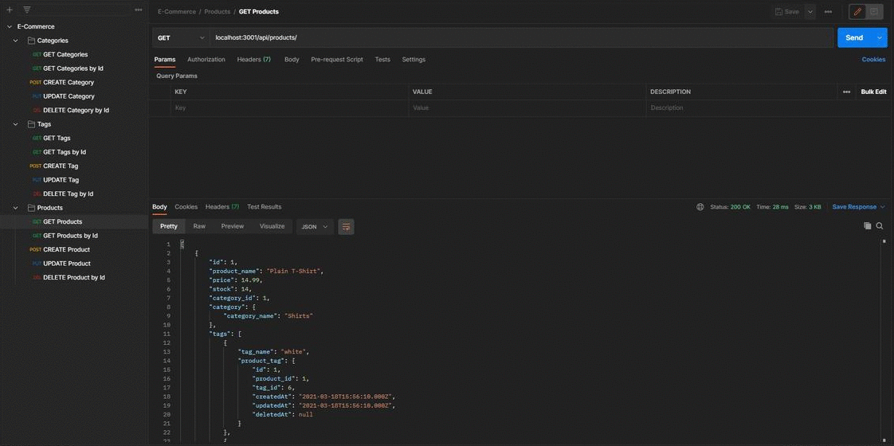

# E-Commerce Back End

This is a short project based off a starter template designed to practice writing back-end code. This project utilizes Node.js, MySQL, Sequalize, and Express.js to connect to create and connect to a local database. Users are able to utilize an API querying software, such as Postman, to make RESTful routes to perform CRUDdy operations upon an E-Commerce esque database.

[Link to Walkthrough Video](https://youtu.be/sxpxfl7-hIk)

## Table of Contents
* [Installation](#installation)
* [Contributors](#contributors)
* [Questions](#questions)
* [License](#license)

# Installation
To install the project, download all of the necessary files and ensure SQL and node are installed to your machine. Run "npm install -y" on the root folder of the project to install the necessary packages.

# Usage
To use the project, run the server via "node server.js". Now with a API querying application, such as Postman or Insomnia, send data to "localhost:3001/api/*" where * is either categories, products, or tags, to perform CRUDdy operations.

# Contributors
Thanks to the following people who have contributed to this project:

* [Scott Byer](https://github.com/switch120) 
* [Mike Fearly](https://michaelfearnley.com/)
* UNH Full Stack Development Bootcamp

# Questions
You can find me at my [github page here](https://github.com/ejhuang2015).
Any comments, questions, or concerns? Email me  at ejhuang.2015@gmail.com.

# License
### Copyright (c) [2021] [ejhuang2015]
View the license in [license.txt](./license.txt)